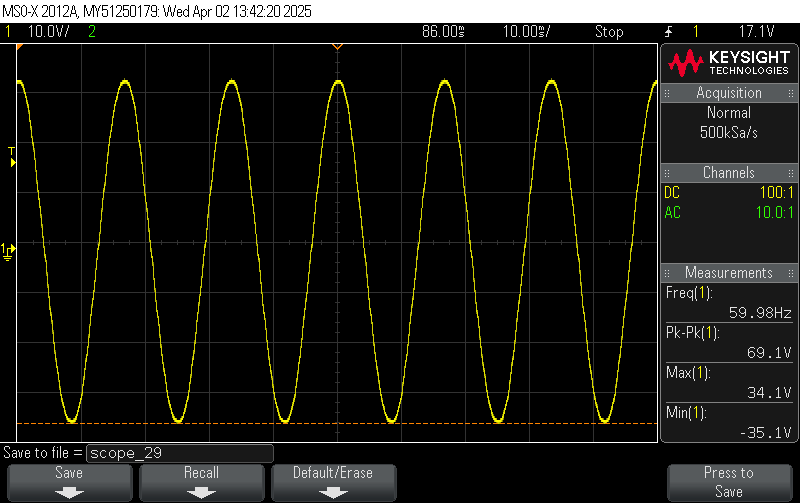

# 1. Input Circuit

1. Soldered **BR1, F1-F2, J1, R15-R16, R99** from the *Input* and test points for `PRI_GND` & `UNREG_DC`. Place 12A fuse.
   	- AC output on `UNREG_DC` with rocker switch OFF: No Output
   	- AC output on `UNREG_DC` with rocker switch ON:
	
2. Desoldered **BR1** and solder on **D1-D4** from the *Input*.
	- AC output on `UNREG_DC` with rocker switch OFF: No Output
	- AC output on `UNREG_DC` with rocker switch ON:
	
3. **BR1** vs **D1-D4** results: **D1-D4** had a lower voltage drop compared to **BR1**. Will continue with **D1-D4** for future testing.

4. Tested AC input waveform.
	

5. Soldered on **C9-C11** from the *Input*.
6. Tested the filtered input:
	- AC output on `UNREG_DC`: 33.8V DC output, less than 0.5% ripple.
	
	- Capacitor discharged to 0V after 60 seconds after rocker switch is OFF.

# 2. Independent Channel A 
## Channel A LVDD
1. This is to test the `A_5V` & `A_3V3` rail.
2. Soldered on **C1, C3, C4, C5, C12, D41, L1, L5, R94, U2** from the *LVDD* and test points for `A_GND`, `A_5V`.
3. Checked the `A_5V` rail.
	- DC output on `A_5V` had ringing noise at a frequency of 42 kHz.
  	
  	- 5V red LED turned on.
	- Ignoring the ringing, the `A_5V` net has a max of 4.99V and a min 4.91V
  	
	- `PRI_GND` & `A_GND` are isolated (using a voltmeter, ohmmeter, and continuity check).
4. Soldered on **C2, C6, D40, U1, R93** & test point for `A_3V3` from the *LVDD*.
5. Checked the `A_5V` rail again.
   	- DC output on `A_5V` had an average output of 4.87V. The ringing was reduced with the **C2** capacitor.
   	  
7. Checked the `A_3V3` rail.
	- DC output on `A_3V3` had an average output of 3.17V.
	- 3V3 yellow LED turned on.

## Channel A ESP32
1. This is to test the ESP32 is powered on. 
2. Solder on **J7, J8**, or the header pins for the ESP32 MCU A, from the *MCU*.
3. Place the ESP32 on following the orientation on the board.
	- Verify the LED on the ESP32 module turns on.

## Channel A External Connections Part 1
1. This is testing the input button & LCD screen for Channel A.
2. Solder on external JST connectors for Channel A labelled **LCD_A, BUTTON_A**.
3. Test to make sure these connections work.
	- Run the Channel_A_Ext_Conn_1.cpp file.
 		- Check to make sure the input from Button A is read properly on the LCD screen.
