The screenshots of the waveforms were taken on a MSO-X 2012A oscilloscope.

# 1. Input Circuit

1. Soldered **BR1, F1-F2, J1, R15-R16, R99** from the *Input* and test points for `PRI_GND` & `UNREG_DC`. Place 12A fuse.
   	- AC output on `UNREG_DC` with rocker switch OFF: No Output
   	- AC output on `UNREG_DC` with rocker switch ON:
	
2. Desoldered **BR1** and solder on **D1-D4** from the *Input*.
	- AC output on `UNREG_DC` with rocker switch OFF: No Output
	- AC output on `UNREG_DC` with rocker switch ON:
	
3. **BR1** vs **D1-D4** results: **D1-D4** had a lower voltage drop compared to **BR1**. Will continue with **D1-D4** for future testing.

4. Tested AC input waveform.
	

5. Soldered on **C9-C11** from the *Input*.
6. Tested the filtered input:
	- AC output on `UNREG_DC`: 33.8V DC output, less than 0.5% ripple.
	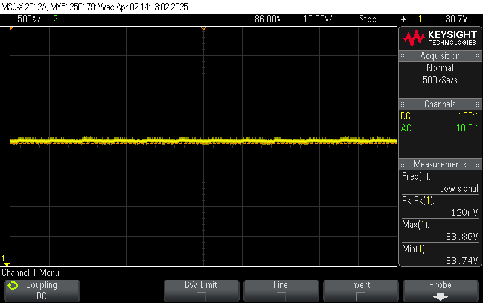
	- Capacitor discharged to 0V after 60 seconds after rocker switch is OFF.

# 2. Independent Channel A 
## Channel A LVDD
1. This is to test the `A_5V` & `A_3V3` rail.
2. Soldered on **C1, C3, C4, C5, C12, D41, L1, L5, R94, U2** from the *LVDD* and test points for `A_GND`, `A_5V`.
3. Checked the `A_5V` rail.
	- DC output on `A_5V` had ringing noise at a frequency of 42 kHz.
  	
  	- 5V red LED turned on.
	- Ignoring the ringing, the `A_5V` net has a max of 4.99V and a min 4.91V
  	
	- `PRI_GND` & `A_GND` are isolated (using a voltmeter, ohmmeter, and continuity check).
4. Soldered on **C2, C6, D40, U1, R93** & test point for `A_3V3` from the *LVDD*.
5. Checked the `A_5V` rail again.
   	- DC output on `A_5V` had an average output of 4.87V. The ringing was reduced with the **C2** capacitor.
   	  
7. Checked the `A_3V3` rail.
	- DC output on `A_3V3` had an average output of 3.17V.
	- 3V3 yellow LED turned on.
	

## Channel A ESP32
1. Tested the ESP32 powers on. 
2. Soldered on **J7, J8**.
3. Placed the ESP32 on the board.
	- LED on the ESP32 turned on.
4. Soldered on **Q5, Q7, R17, R18** and test points `BUCK_A_nPWM`, `BUCK_A_PWM`, & `OUT_A_LV`.
5. Determined the accuracy of PWM duty cycle & logical level shift voltage levels.
	- Ran the Channel_A_ESP32_PWM.cpp file.
		- The PWM was set to 10kHz with a 10% duty cycle. `BUCK_A_PWM` showed exactly 10% and `BUCK_A_nPWM` had 90%. The PWM from the ESP32 has an accurate duty cycle.
		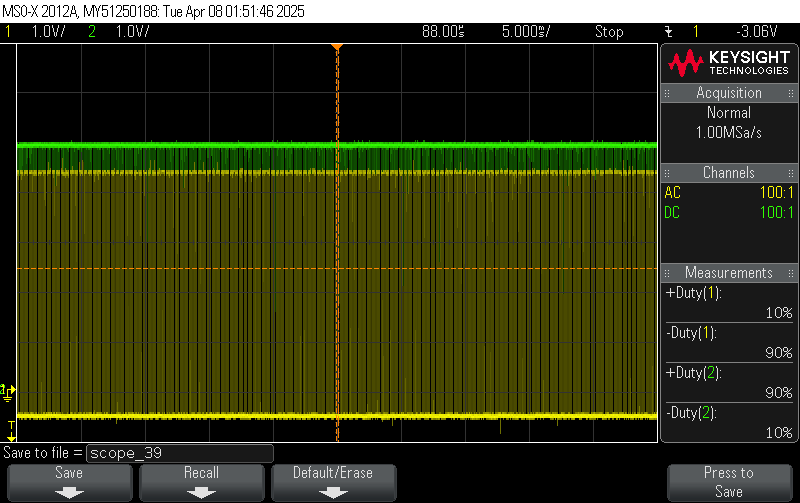
			- Logical level shifts between `A_GND` & `A_5V` for `BUCK_A_PWM` and`BUCK_A_nPWM` at 10kHz.
   		 	
     			
     
	- Test was then run for 50kHz.
		- The PWM was set to 50kHz with a 10% duty cycle. `BUCK_A_PWM` showed approximately 10% and `BUCK_A_nPWM` had 90%. The PWM is accurate also at 50kHz.
		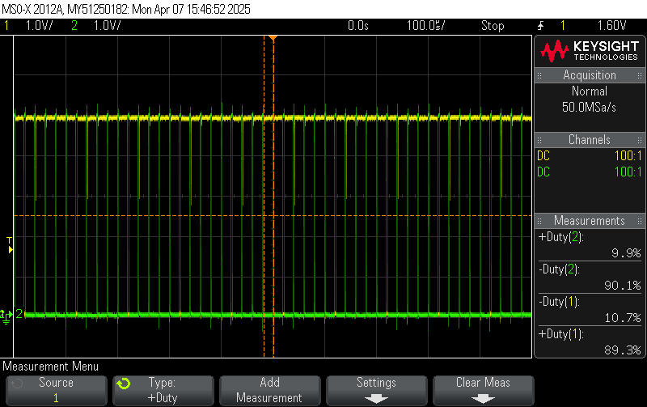
			- Logical level shifts between `A_GND` & `A_5V` for `BUCK_A_PWM` and`BUCK_A_nPWM` at 50kHz.
   		 	
     			
     

## Channel A External Connections Part 1
1. Tested the input button & LCD screen for Channel A.
2. Soldered on external JST connectors, **R5 & R7** for Channel A labelled **LCD_A, BUTTON_A**.
3. Tesedt to make sure these connections work.
	- Ran the Channel_A_Ext_Conn_1.cpp file.
		- LCD correctly displayed BUTTON LOW or BUTTON HIGH depending on the button state.
   		- The button itself also lit up the internal LED.

## Channel A Temperature Sensor
1. Tested the temperature sensor.
2. Soldered on **C37, R46, R47, U7**.
3. Soldered on $51k\Omega$ for **R54**.
	- Ran the Channel_A_Temp_Sense.cpp file.
		- Used a hot air gun set at $100^{\circ}C$. Temperature sensor sent LOW to *A_TMP_SNSE* when the hot air gun was pointed at it. Temperature sensor sent HIGH in room temperature.
		- The temperature sensor should go off at around $52^{\circ}C$.
4. Finalized on a resistor value for **R54** is to determine a temperature cut off.
	- $50k\Omega$ for $53^\circ C$ threshold.

## Channel A Transformers
1. This is to test the flyback & feedback transformer. 
    - An issue was found with the switching MOSFET **Q35** and its pull up resistor **R61**. Due to the low resistance of the feedback transformer, the output would never be pulled up to 5V through the **R61** resistor. To fix this, an isolated gate driver (UCC5304DWV) was purchased to replace **Q35, R61 & T4**. The isolated gate driver accepts the MCU PWM input and outputs it to the gate of **Q38** on the primary side.
    	- The isolated gate driver has a noticable issue where the output voltage does not match the VDD provided on the primary side of the isolation. A significant voltage drop is noticed, which will need to be addressed.
    - Another issue was noticed with the dot polarity of the transformer. The architecture for the flyback converter required opposing dot polarities, which were missed during the schematic phase of the project. To fix this, the pins for `SEC_FET_A` and `FLY_OUT_A` were swapped by soldering on jumper wires.
    - Snubbers were also added to **Q29 & Q38**. Both transistors got a capacitor and resistor across their drain and source pins. **Q38** had a resistor of $22\Omega$ and a capacitor of 680pF, while **Q29** had a resistor of $15\Omega$ and capacitor of 680pF. The snubbers were found on an online [Snubber Calculator](https://biricha.com/tools-and-downloads/flyback-rc-snubber-design/).
    - We also changed the pull up resistor **R70** from $1k \Omega$ to $150 \Omega$.
    - The filter capacitors on `FLY_OUT_A` were also changed to three 470uF, a 1uF and a 47nF capacitors. After numerous testing, the finalized values for the capacitors were 10pF + 100pF + 47nF + 1uF + 470uF + 1mF + 2.2mF.
    - After multiple fuses being blown when attempting to reach a higher output voltage on `FLY_OUT_A`, it was found that a "soft start" is required, where we begin with a lower duty cycle and transition to a higher one after a certain time delay.
    - New ways of verifying damaged components were found, such as tests for transformers, MOSFETs, and ISO driver.
2. Soldered on the following circuits so that the feedback transformer can work.
    - Soldered on a $8.2k\Omega$ on the `UNREG_DC` and a $6.8k\Omega$ on `PRI_GND`, creating a voltage division of 15.1V, along with a 10uF elecotrlytic capacitor at the voltage division.
    - Soldered on the **UCC5304DWV** to the board. Use enamel wire to connect:
    	- Pin 1: `A_DRIVE`
     	- Pin 2 & 3: `A_5V`
      	- Pin 4: `A_GND`
      	- Pin 5 & 6: `PRI_GND`
      	- Pin 7: the gate of **Q29**
      	- Pin 8: The 15.1V line made from the voltage division.
3. Tested the new feedback transformer replacement circuit.
    - Ran the Channel_A_Transformer_Gate.cpp file.
		- 10-11V Output (Probably loading effect). PWM signal at 50kHz with a 25% duty cycle at 10V.
4. Soldered on **C24, C25, C26, Q29, Q38, Q39, R70, R101, T2** and test points `FLY_OUT_A`, `PRI_FET_A` & `SEC_FET_A`.
	- Ran the Channel_A_Transformer1.cpp file.
		- Smoke came out immediately, the `PRI_GND` copper exploded and continuity between the ground plane was gone. The 5V buck was also damaged. Also removed **Q29, Q38**.
   		- Added a new buck and a `PRI_GND` wire. Circuit worked fine without running the PWM output.
		- Added new **Q29, Q38** transistors and ran the script again. Smoke once again came from the thermistor and transformer. 12A fuse was blown. Circuit is pulling too much current.
	- Also noticed that the previous PCB also had damage to the `PRI_GND` trace.
5. After multiple frequency and duty tests were ran it was found that as the switching frequency increases, the maximum `FLY_OUT_A` voltage decreases. This means that a "buzzing" sound is heard the higher the duty cycle is set to. However, the overall voltage ripple decreases as the frequency increases. By decreasing the frequency, the "buzzing" sound will be heard at a higher frequency.
   - A frequency of 42kHz was finalized for the transformer after multiple tests were ran. The available duty cycles were also set to 10%-40% which translates to `FLY_OUT_A` voltages of 3.35V-18.78V. The minimum time delay between stepping up the duty cycle was determined to be 1% per 0.1s in the code, or 1% per 0.18s after measured on the oscilloscope.
   - The graph below displays a snapshot of the flyout transformer output (yellow).
	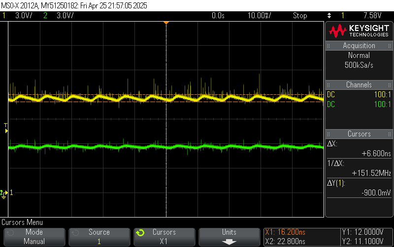
6. The test below is running the Channel_A_Transformer2.cpp script, which sweeps the duty cycle from 102 to 412 at a rate of 10 bits per 100ms at 42kHz frequency.
   - 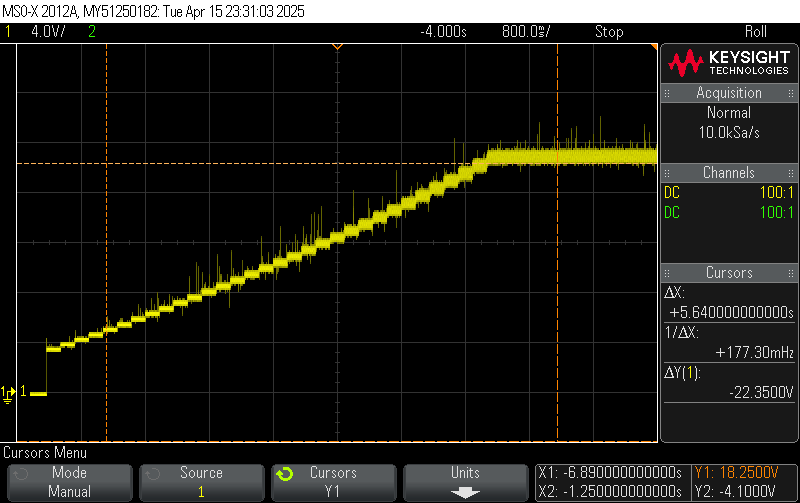

## Channel A HV/LV 
1. Tested the HV & LV relays + buck converter on a bare board.
2. Soldered on **C23, D5, D6, K1, K2, L3, Q2, Q12, Q56, R21** and test points `OUT_A_HV`,`OUT_A_BUCK`, and `OUT_A_CURR`.
3. Used a clean 12VDC input for the bare board.
4. Tested HV side (through line).
	- Ran the Channel_A_HV_SW.cpp file.
		- Sent a LOW signal to *A_HV_LV_OUT*. 
		- Relays switched and the input from `FLY_OUT_A` disappeared from `OUT_A_HV`. 
5. Tested LV side (buck converter).
	- Ran the Channel_A_LV_Buck1.cpp file.
		- Sent a LOW signal to *A_HV_LV_OUT* with `FLY_OUT_A` set to 12VDC and *A_BUCK* is set to 50% duty cycle at 10kHz.
			- Relays clicked as the *A_HV_LV_OUT* changed.
			- A high pitch buzzing sound was heard as soon as the relays switched and the buck converter was being used.
		- Confirmed that `FLY_OUT_A` and `OUT_A_LV` are both 12V. 
			- `OUT_A_HV` was floating.
		- Confirmed `OUT_A_BUCK` and `OUT_A_CURR` were around 5.69V. There was a 10kHz ripple throughout the output, with a peak-to-peak of 1.1V. High ripple had to be reduced.

   		
6. Determined the duty cycle needed for 1V, 10V at `OUT_A_BUCK`.
	- Edited and ran the Channel_A_LV_Buck1.cpp file.
		- Duty cycle 1V and 10V occurs: *9.75%* & 88.86%* maximum buck duty cycle or in terms of bit duty cycle (100 & 910).
   		- High ripple on the output voltages.
7. Made edits to reduce the overall ripple.
 	- Increased frequency to 35kHz from 10kHz for a lower ripple.
	- Added $1k\Omega$ parallel resistor to **R17 & R18** to decrease overall resistance. Got a clearer PWM on `BUCK_A_PWM` and `BUCK_A_nPWM` which increased its duty cycle. This also reduced the ripple voltage.
  	- New clean 12VDC 35kHz, 50% duty cycle results:
      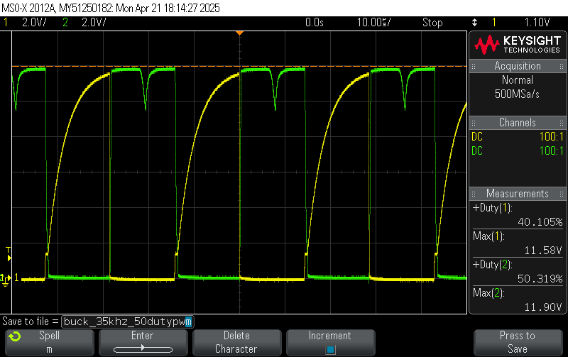
     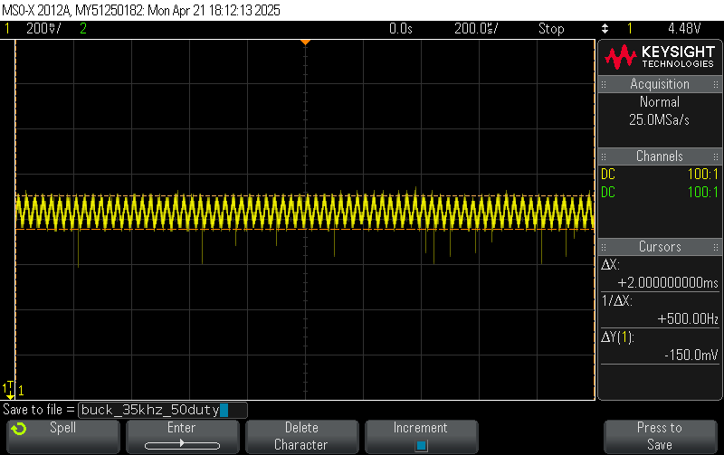
8. Tested and assembled on actual board. Added the additional pull up resistors in parallel with **R17 & R18**.
9. Tested LV and HV side.
 	- There is a strong ripple after the buck starts driving the transformer input. Usually lasts for a maximum of 15 seconds and then settles to a lower ripple. Frequency does not affect the ripple time, nor does starting with a large voltage and decreasing or a low voltage and increasing the buck output voltage. It was found that 1% per 100ms is better  than 3% per 200ms for the buck PWM control. Based on how long the circuit was discharged for, the spikes last less.
 	 - Large ripple needs to be addressed, possibly snubbers, smaller caps etc.
10. Added additional capacitors to reduce the rippling on the buck converter.
	 - The final cap values on the buck circuit are: 10pF, 10uF, and 47uF.
  	 - This is what the final output looks like for the buck converter circuit @ 35kHz and 50% duty cycle (green is buck converter, yellow is flyout transformer).
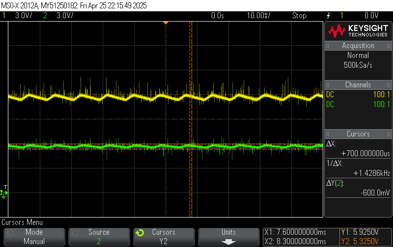
11. Next the buck PWM was swept across to see map the duty cycle value to the buck converter output.
         - Note: There wasn't a chance to sweep the buck converter output without buzzing from the flyback converter. This buzzing was determined to come from the flyback converter because when the buck converter was tested in isolation, there was no buzzing and the rippling was satisfactory.
         - 

## Channel A Current Sense & OVP
1. Tested the current sense & OVP circuit on a bare board. (She Died)
2. Soldered on **C31, C32, C33, D9, D10, D11, D12, D13, J4, Q13, Q15, Q44, R25, R26, R27, R30, R31, R33** and test points `OUT_A` and `A_PROT_OUT`.
3. Connected a $11.2\Omega$ 10W power resistor between `A_PROT_OUT` and `A_GND` and an ammeter between the fuse pins for **J4**.
4. Tested the current sense.
	- Ran the Channel_A_CURR_SENSE.cpp file.
		- Recorded the ADC bit values compared to a multimeter measurement for voltages ranging from 1-20V. Mostly linear results, around 25mA tolerance on the accuracy of the current readings. (Expected 10mA accuracy).
5. Tested the OVP circuit on a bare board. (She Died)
 	- Soldered a wire shorting **D9**.
	- Run the Channel_A_CURR_SENSE.cpp file (just using it to ignore the buck converter circuit).
  		- Injected voltage into `FLY_OUT_A`, probing `OUT_A` and `A_PROT_OUT` to see the result of OVP.
 		- OVP was triggered when `FLY_OUT_A` was set to 22.05V.
		- Voltage drop between `OUT_A` and `A_PROT_OUT` was around 100mV without OVP triggered.
6. Tested the current sense on real board. Huge ripple was observed with a 20 ohm power resistor. Current was also too low for the current sense to get accurate readings. Decision was made to use only high output resistance loads and to not use current sense.
   	- Higher current leads to higher buzzing.
  
## Channel A Enable
1. Tested Channel A enable. (She Died)
2. Soldered on **C44, Q17, Q19, R24, R37, R62** and test point `CHANNEL_A`.
   	- Problem was noticed with the circuit, **Q17** would have an improper $$V_{GS}$$. When the gate is driven low, the circuit operates correctly with no output voltage at `CHANNEL_A`. However, when the gate was driven high, the source would reach a higher voltage than the gate, effectively making the **Q17** fail as a switch since it is an NMOS. To solve this, a relay was soldered on to act as the switch instead of the stated components..
3. Tested the enable signal & voltage drop.
	- Ran the Channel_A_Enable1.cpp file.
		- Sent a LOW to *A_OUT_EN*: `OUT_A` is giving a VDC output, but `CHANNEL_A` is low.
		- Sent a HIGH to *A_OUT_EN*:`OUT_A` and `CHANNEL_A` are nearly equal. 
			- Voltage drop across `FLY_OUT_A` and `CHANNEL_A`: 50mV-100mV
	- Make sure the **C44** is discharged after the ***5s***.
4. Tested Channel A enable on real board.
5. Soldered on the relay circuit, worked.

## Channel A Feedback
1. This is to test the feedback signal from Channel A output.
2. Solder on **D29, R67, R68, R69, U9** and test point `A_SENSE_IN`.
3. Test the feedback signal.
	- Ran the Channel_A_Feedback.cpp file. Voltage_Feedback
		- Mapped the output voltages measured at `A_PROT_OUT` to the ADC readings (displayed on the LCD screen).
  - 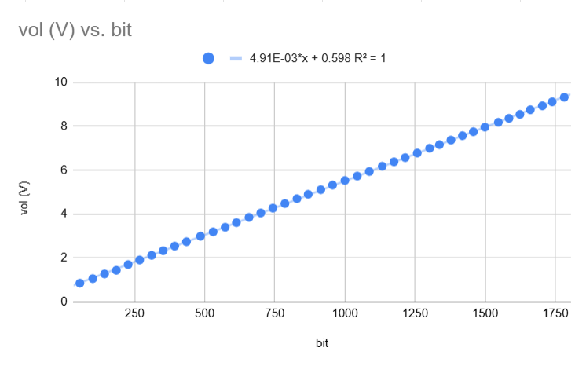

---

## Channel B LVDD
1. Tested the `B_5V` & `B_3V3` rail.
2. Soldered on the same set of components as Channel A (**C13, C14, C15, C16, C17, C19, D44, L2, L6, R97, U4**) and test points for `B_GND`, `B_5V`. 
3. Checked the `B_5V` rail.
	- The yellow LED is ON (similar to Channel A).
	- Verify `PRI_GND` & `B_GND` are isolated (using an ohmmeter).
4. Soldered on **C18, D43, U3, R96** & test point for `B_3V3`.
5. Checked the `B_3V3` rail.
	- The red LED is ON.
 	- Screenshot showing BC_5V and BC_3V3 waveforms:
	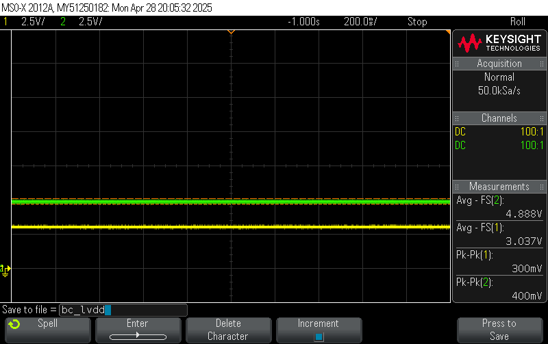

## Channel B ESP32
1. This is to test the ESP32 is powered on. 
2. Solder on **J10, J11**, or the header pins for the ESP32 MCU B.
3. Place the ESP32 on following the orientation on the board.
	- Verify the LED on the ESP32 module turns on.
4. Solder on **Q6, Q8, R19, R20** and test points `BUCK_B_nPWM`, `BUCK_B_PWM`, & `OUT_B_LV`
   	- Added $1k\Omega$ parallel resistor to **R19 & R20** to decrease overall resistance.
   	- Waveform of the logical level shift circuits can be seen in the waveform (yellow and green are NOT'd of each other).
   	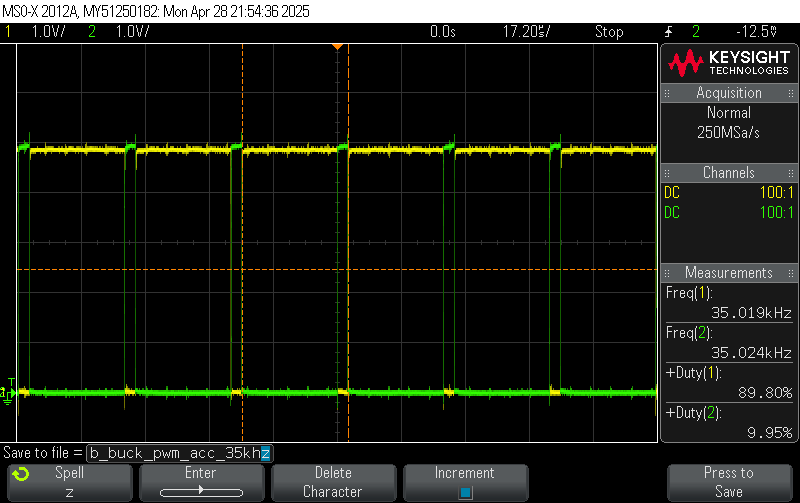
6. Determine the accuracy of PWM duty cycle & logical level shift voltage levels.
	- Run the Channel_B_ESP32_PWM.cpp file.
		- Connect the `OUT_B_LV` to `B_5V` & measure this voltage.
		- Set the PWM to 10kHz with 10% duty cycle and measure how accurate the duty cycle is on the `BUCK_B_PWM` and `BUCK_B_nPWM` (should be 1 - duty cycle) & record the difference. This accuracy will be denoted as the *percent accuracy*.
			- Make sure that the logical levels for these circuits switches between `B_GND` & `B_5V`. 
		- Run these tests again in increasing order of 10kHz until you reach 50kHz and measure the *percent accuracy* for each frequency.

## Channel B External Connections Part 1
1. This is testing the input button & LCD screen for Channel B.
2. Solder on external JST connectors for Channel B labelled **LCD_B, BUTTON_B** and **Q34, R6, R8**.
3. Test to make sure these connections work.
	- Run the Channel_B_Ext_Conn_1.cpp file.
		- Check to make sure the input from Button B is read properly on the LCD screen.

## Channel B Temperature Sensor
1. This is to test the temperature sensor.
2. Solder on **C38, R59, R60, U8**.
3. Solder on $51k\Omega$ for **R66**.
	- Run the Channel_B_Temp_Sense.cpp file.
		- Make sure the temperature sensor sends HIGH to *B_TMP_SNSE* at room temperature with this displayed on the LCD.
		- Make sure the temperature sensor sends a LOW signal with hot air gun at $55^{\circ}C$ (can set it up to $65^{\circ}C$) aimed at the temperature sensor and this is displayed on the LCD.
			- The temperature sensor should go off at around $53^{\circ}C$.

## Channel B Transformers
1. This is to test the flyback & feedback transformer.
2. Solder on **Q40, Q41, Q48, R102, T3** and test points `FLY_OUT_B`, `PRI_FET_B` & `SEC_FET_B` (use the same values for the capacitors as channel A, listed later on). Note: Use the iso gate driver (UCC5304DWV) circuit for the FET on the primary side. **R72** was replaced with a 150 ohm through hole. Use these capaicotrs for the flyout_b output: 10pF + 100pF + 47nF + 1uF + 470uF + 1mF + 22mF.
4. Check the flyback transformer outputs VDC at `FLY_OUT_B`.
	- Run the Channel_B_Transformer1.cpp file.
		- With the MCU, send a fixed PWM at the same frequency for *B_DRIVE* as *A_DRIVE* for the transformer with a 25% duty cycle. Record the VDC at `FLY_OUT_B` (should be approximately 10.9V $\pm$ 2V) & record how long it takes for the output to settle (call this *transformer settle time*).
			- ***MAKE SURE THE DUTY CYCLE IS BELOW 50% ALWAYS!!!***
   		- This is what the waveform looks like for this step (expected 3V output):
       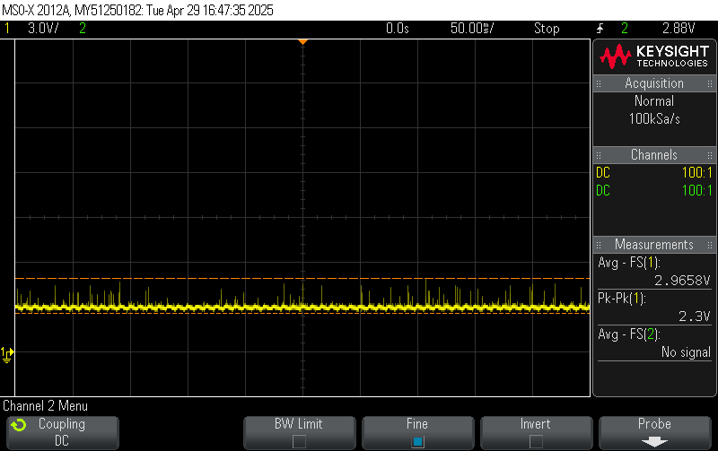
		- Verify one last time that `PRI_GND`, `A_GND`, and `B_GND` are all isolated from each other (using an ohmmeter).
		- Check capacitor voltage is 0V after the rocker switch is OFF after the ***universal wait time***.
  	- Note: The isolated gate driver VDD was also checked since it was seen before the VDD line on the primary side of the circuit drops significant when the chip is being used vs. not being used. This is displayed by the green waveform on the image below:
     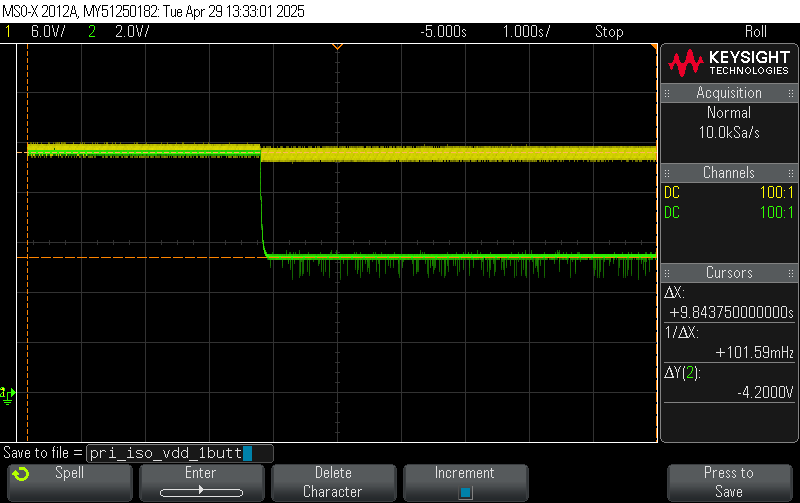
5. Determine the duty cycle needed for 10V, 12V, 20V at `FLY_OUT_B`.1
	- Edit and run the Channel_B_Transform1.cpp file.
		- Based on the previous step, determine at what duty cycle 10V, 12V, and 20V occurs at. Record these values as *minimum duty cycle*, *LV duty cycle*, & *maximum duty cycle*.
		- Make sure these duty cycles are very close to the duty cycles found in Channel A, if not the same. 
6. Problem was found with the proximity of the LCD SDA pin (GPIO21) and the drive PWM pin (GPIO19). PWM pin seems to cause some sort of EMI that interferes with the ESP32 and the I2C lines. Changed the flyback drive pin to GPIO12. Resoldered **Q48** and the 150 ohm resistor to be floating to prevent the PWM signal from any interferance on the internal trace of the PCB.
   
# What Happened Afterwards for Channel B
After the flyback transformer for Channel B seemed to work for a fix voltage, there was massive rippling and constant buzzing from the transformer no matter what duty cycle was sent to the transformer (including 3V), and there was no *settle time* this time for the transformer. Sometimes the buzzing would be insistent for 2 minutes with no end to it, other times the buzzing would gradually get larger until we turned off the circuit. These buzzing can be seen in the images below: 
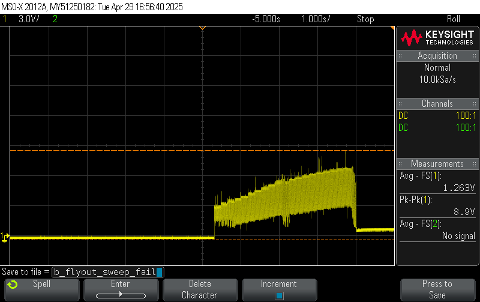
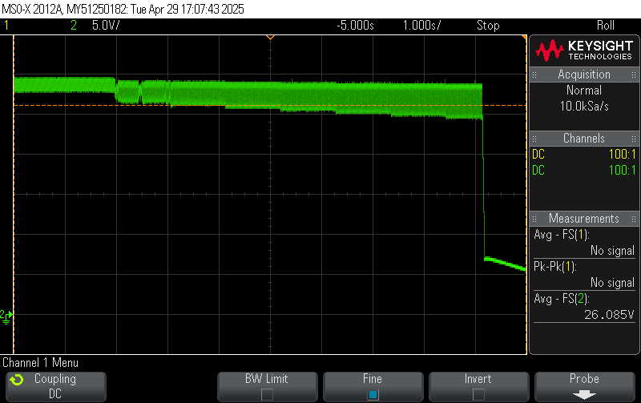

After reviewing the design, it is most likely that the transformer buzzed due to magnetostriction, since the transformer weren't flushly mountly against the PCB (the dot polarity had to be swapped through wire rework). The magnetostriction caused audible buzzing in addtion making the voltage a lot less stable which increased the ripple of the voltages.
 	- We found that that the `UNREG_DC` also had substantial ripple after connecting the flyback transformer for Channel (seen by the yellow waveform in the image below), which can be explained by the phenomeon above.
	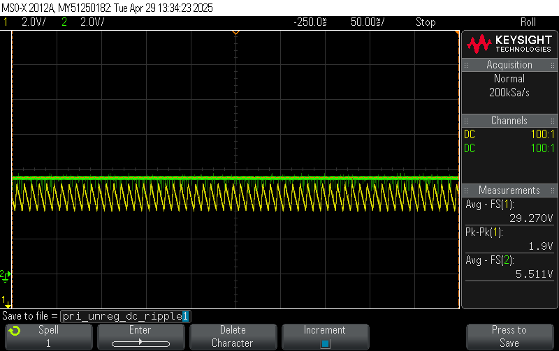

No further screenshots were taking during this process, but this conclusion was reached when testing the I2C line (for the LCD screen) in isolation and there were no issues, but issues always arose when the flyback transformer B was drive with a PWM signal. 

When probing the waveform and looking at the LCD screen, we noticed that the MCU would switch between states in the Channel_B_Transformer2.cpp file (where the LCD would flip between the PWM reading and PWM 0). The root cause of this was never fully determined as to what caused this & why the MCU would glitch out like this (the states and PWM signal would function properly when the MCU was tested in isolation and only flip constantly when it was running the code on the PCB). It was noticed that there would be a 20ms (~50Hz) delay before the MCU PWM waveform would drop, continue, then drop after 25ms and it would cycle like this continuously. One theory was that the 50Hz could be source from the main line transformer (which steps down 120V to 24V), but as to why this would be occuring, and why it was 50Hz and not 60Hz it couldn't be explained. The transformer was noticed to be physically vibrating when the circuit was switched ON.

After this we attempted to test Channel A again but the buzzing was much more audible and while waiting to see if the transformer would settle or not, the transformer stopped working anf `FLY_OUT_A` no longer produced an output despite the PWM signal was still being generated. We decided from here to forgo anymore testing using all flyback transformer.

# Channel C Testing
To test Channel C, the entire board was soldered on at once due to the approaching deadline. Channel C was tested to see if theoretically a voltage supplied to `FLY_OUT_C` if the rest of the USB-C circuit would work or not by injecting a 5V signal into `BC_5V` & `FLY_OUT_C` from an external power supply. 

The first waveform shows that OVP circuit for Channel C works where the green waveform is `FLY_OUT_C` and the yellow is `C_PROT_OUT`.

The next waveform was to display that the button for Channel C does enable the output for TPS25810RVCR. Note that the voltage for the `USB_5V` would only be enabled if there's a load connected at the end of the USB connector (since USB protocol required the CC pull down resistors to be detected to supply an output). The first waveform shows when the button is off, the second shows when the button is connected where the yellow waveform is `C_PROT_OUT` and the green waveform is `USB_5V`.
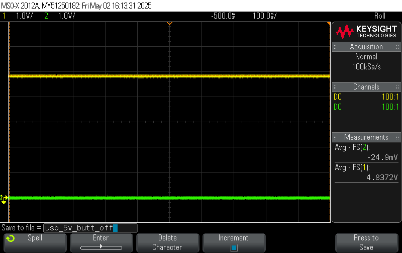
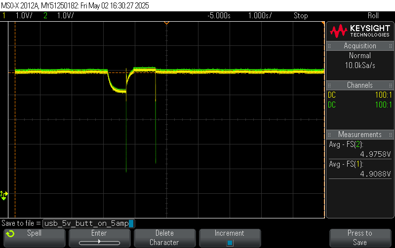

For the 2nd image above, the load connected to the USB-C was the [DROK USB Load Tester](https://a.co/d/2gTHWYz). A [Power-Z KM003C](https://a.co/d/hrM3BIw) USB-C oscilloscope reader used to record the voltage, current, and power rating supplied from Channel-C. Unfortunately, there was no good way of saving images from this oscilloscope. The image above shows the results when the USB-C load tester draws 0.5A of current, diplaying that the voltage does give a steady 5V. 

After this, the load tester was adjusted up to 3A, and the output power was about 12.6W. As the current went up, the voltage on the USB line slowly dropped until it roughly reached 4.2V, which is why the power for the load was 12.6W, not 15W. From here, the USB Load Tester was disconnected and instead, a Samsung Galaxy Tab A SM-T350 was used as a load to verify USB-C charging would work. The tablet uses a micro usb charging port, so a USB-C to micro usb adapter was used. After turning on the circuit, the tablet displayed it was successfully charging at BLANK V, BLANK A, for a total of BLANK W. This can be seen in the image below.

Finally, a BLANK PHONE MODEL was used as testing and the Channel C was shown to be working properly. It was charging the device at BLANK V, BLANK A, for a total of BLANK W. The image for this can be seen below. Also, from the USB oscilloscope, it can be seen that the controller circuit was able to properly detect the different chargining protocols and output the output as intended.
